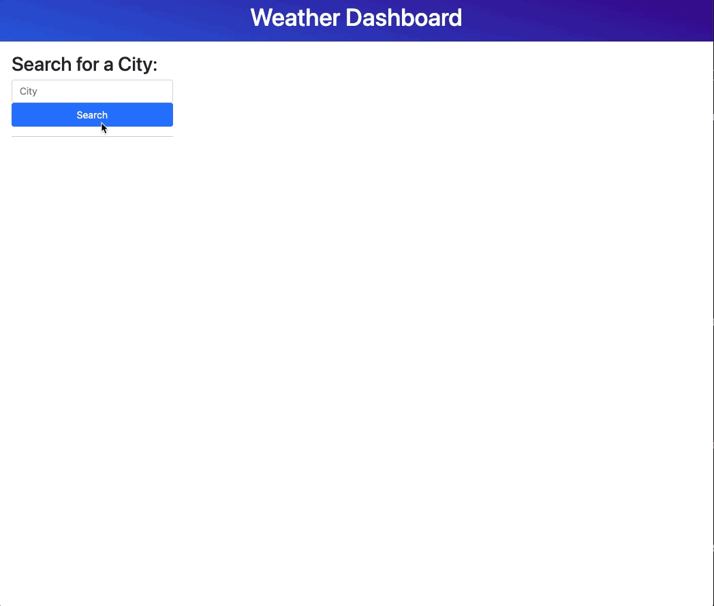
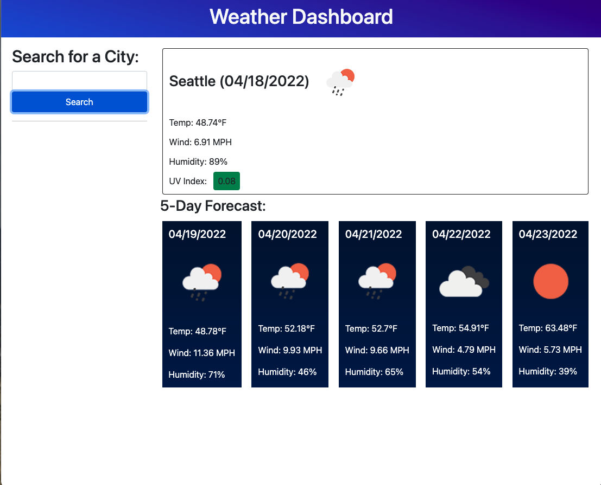

# Weather Dashboard
Application to let a user lookup weather conditions of a city.

## Description

This application lets a user lookup current and future weather conditions of a city.  User types in city in textbox and clicks on "submit" and they will receive current and 5-day forecast of a city, which include temperature, wind, humidity, UV index, and weather icon.

## Deployed Application
URL of deployed application [Weather-Dashboard] (https://marvanessa1.github.io/Weather-Dashboard/).

## Weather Dashboard Mock-Up

The screenshots below demonstrate the web application's appearence and funtionality:

Screenshot GIF

Screenshot image

